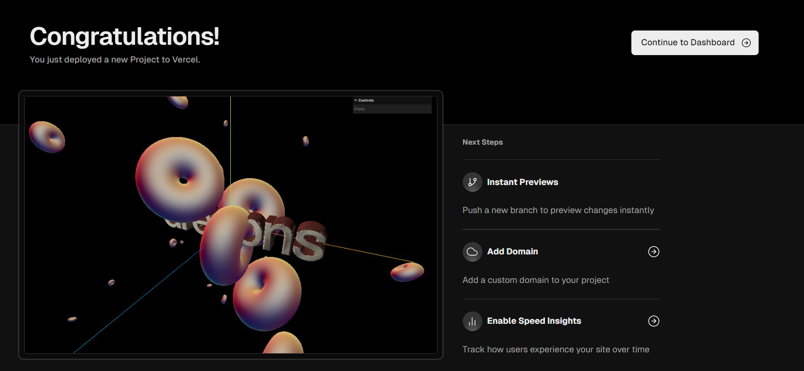

# My Very First Project 🚀



## ⚙️ Setup
Download [Node.js](https://nodejs.org/en/download/).
Run this followed commands:

```bash
# Install dependencies
npm install

# Run the local server
npm run dev

# Build for production in the dist/ directory
npm run build
```

Instead of doing `npm run build`, we are going to use **Vercel**.

### ⚙️ Local Setup
```bash
npm install vercel
npm audit fix
npm audit fix --force
```